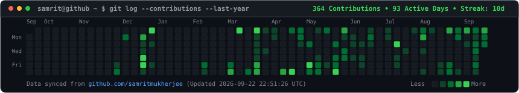
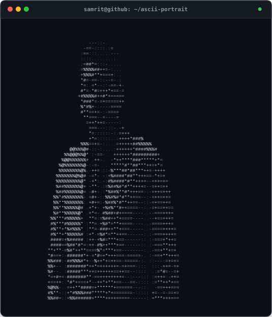
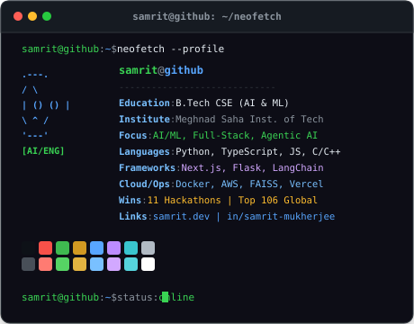

<picture>
  <source srcset="assets/heading-01.svg" type="image/svg+xml">
  
</picture>

  <picture>
    <source srcset="assets/contribution-heatmap.svg" type="image/svg+xml">
    
  </picture>

---

<picture>
  <source srcset="assets/heading-02.svg" type="image/svg+xml">
  
</picture>

<table align="center" width="100%" border="0">
  <tr>
    <td width="50%" align="center" valign="top">
      <picture>
        <source srcset="assets/ascii-portrait.svg" type="image/svg+xml">
        
      </picture>
    </td>
    <td width="50%" align="center" valign="top">
      <picture>
        <source srcset="assets/info-card.svg" type="image/svg+xml">
        
      </picture>
    </td>
  </tr>
</table>

---

<h1 align="center">
  <code>samrit@github ~ $ whoami</code>
</h1>

  <strong>Samrit Mukherjee</strong> • B.Tech CSE (AI &amp; ML) @ Meghnad Saha Institute of Technology, Kolkata 
  <em>AI/ML Engineer &bull; Full-Stack Developer &bull; Automation &bull; Agentic AI</em>

  
  &nbsp;
  
  &nbsp;
  

---

<picture>
  <source srcset="assets/heading-03.svg" type="image/svg+xml">
  
</picture>

#### Languages

  <a href="https://www.java.com/"> <code>Java</code></a> &nbsp;&nbsp;
  <a href="https://www.python.org/"> <code>Python</code></a> &nbsp;&nbsp;
  <a href="https://en.wikipedia.org/wiki/C_(programming_language)"> <code>C</code></a> &nbsp;&nbsp;
  <a href="https://isocpp.org/"> <code>C++</code></a> &nbsp;&nbsp;
  <a href="https://developer.mozilla.org/en-US/docs/Web/JavaScript"> <code>JavaScript</code></a> &nbsp;&nbsp;
  <a href="https://www.typescriptlang.org/"> <code>TypeScript</code></a> &nbsp;&nbsp;
  <a href="https://www.swi-prolog.org/"> <code>Prolog</code></a>

#### Frontend

  <a href="https://developer.mozilla.org/en-US/docs/Web/HTML"> <code>HTML</code></a> &nbsp;&nbsp;
  <a href="https://developer.mozilla.org/en-US/docs/Web/CSS"> <code>CSS</code></a> &nbsp;&nbsp;
  <a href="https://react.dev/"> <code>React</code></a> &nbsp;&nbsp;
  <a href="https://nextjs.org/"> <code>Next.js</code></a> &nbsp;&nbsp;
  <a href="https://tailwindcss.com/"> <code>Tailwind CSS</code></a> &nbsp;&nbsp;
  <a href="https://www.framer.com/motion/"> <code>Framer Motion</code></a>

#### Backend

  <a href="https://nodejs.org/"> <code>Node.js</code></a> &nbsp;&nbsp;
  <a href="https://flask.palletsprojects.com/"> <code>Flask</code></a> &nbsp;&nbsp;
  <a href="https://fastapi.tiangolo.com/"> <code>FastAPI</code></a> &nbsp;&nbsp;
  <a href="https://www.openapis.org/"> <code>REST APIs</code></a> &nbsp;&nbsp;
  <a href="https://en.wikipedia.org/wiki/SQL"> <code>SQL</code></a>

#### AI / ML

  <a href="https://numpy.org/"> <code>NumPy</code></a> &nbsp;&nbsp;
  <a href="https://pandas.pydata.org/"> <code>Pandas</code></a> &nbsp;&nbsp;
  <a href="https://gemini.google.com/"> <code>LLM APIs</code></a> &nbsp;&nbsp;
  <a href="https://www.langchain.com/"> <code>RAG Systems</code></a>

#### Tools & Platforms

  <a href="https://git-scm.com/"> <code>Git</code></a> &nbsp;&nbsp;
  <a href="https://github.com/"> <code>GitHub</code></a> &nbsp;&nbsp;
  <a href="https://vercel.com/"> <code>Vercel</code></a> &nbsp;&nbsp;
  <a href="https://aws.amazon.com/"> <code>AWS</code></a> &nbsp;&nbsp;
  <a href="https://razorpay.com/"> <code>Razorpay</code></a>

#### Design & Media

  <a href="https://www.figma.com/"> <code>Figma</code></a> &nbsp;&nbsp;
  <a href="https://www.canva.com/"> <code>Canva</code></a> &nbsp;&nbsp;
  <a href="https://www.adobe.com/products/photoshop.html"> <code>Adobe Photoshop</code></a> &nbsp;&nbsp;
  <a href="https://filmora.wondershare.com/"> <code>Filmora</code></a> &nbsp;&nbsp;
  <a href="https://www.interaction-design.org/"> <code>UI/UX</code></a>

#### Core Concepts

  <a href="https://leetcode.com/"> <code>DSA</code></a> &nbsp;&nbsp;
  <a href="https://www.anthropic.com/"> <code>AI Systems</code></a> &nbsp;&nbsp;
  <a href="https://stackshare.io/"> <code>Full Stack Engineering</code></a> &nbsp;&nbsp;
  <a href="https://www.producthunt.com/"> <code>Product Development</code></a>

---

<picture>
  <source srcset="assets/heading-04.svg" type="image/svg+xml">
  
</picture>

* **11 Hackathon Wins**
* **TOP 106 GLOBALLY**: Google Solution Challenge 2026 — Build with AI
* **WINNER**: Double Slash 4.0
* **WINNER**: Showcase X Techsprint
* **Best Startup Track**: Synchronicity 2.0

---

  <code>samrit@github ~ $ exit 0</code> &bull; Built with custom self-contained SVGs &bull; Updated via GitHub Actions

